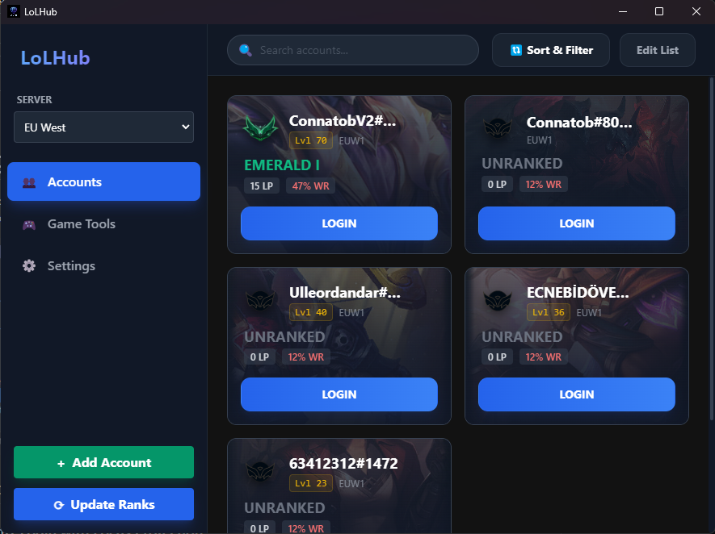
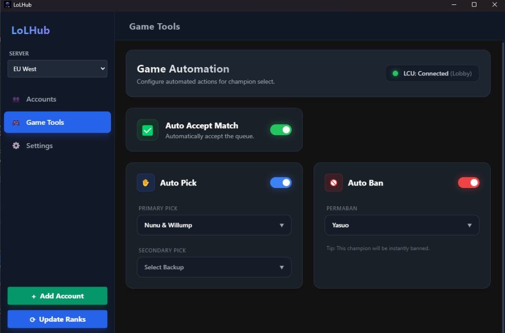
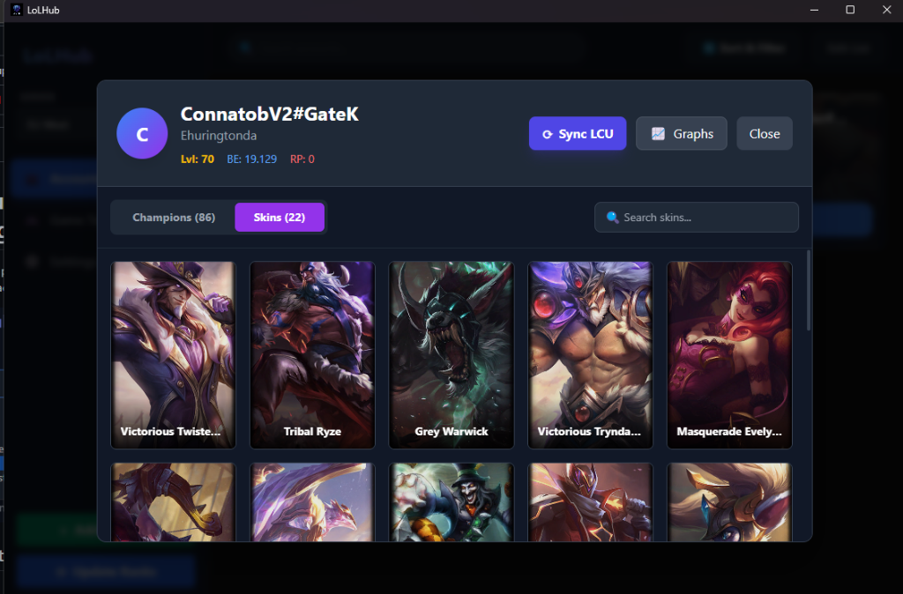
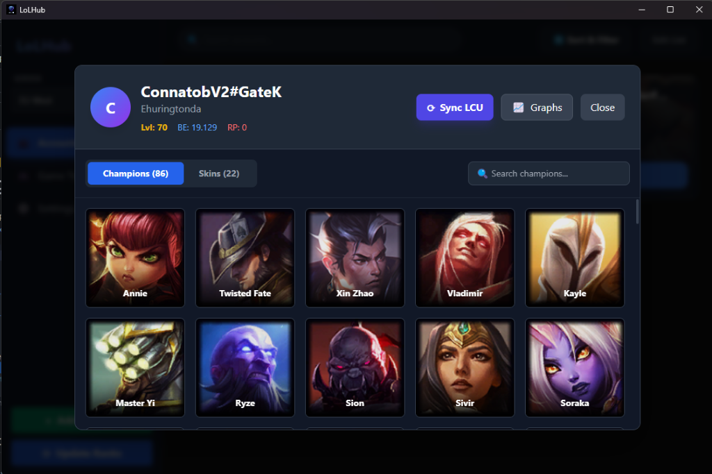
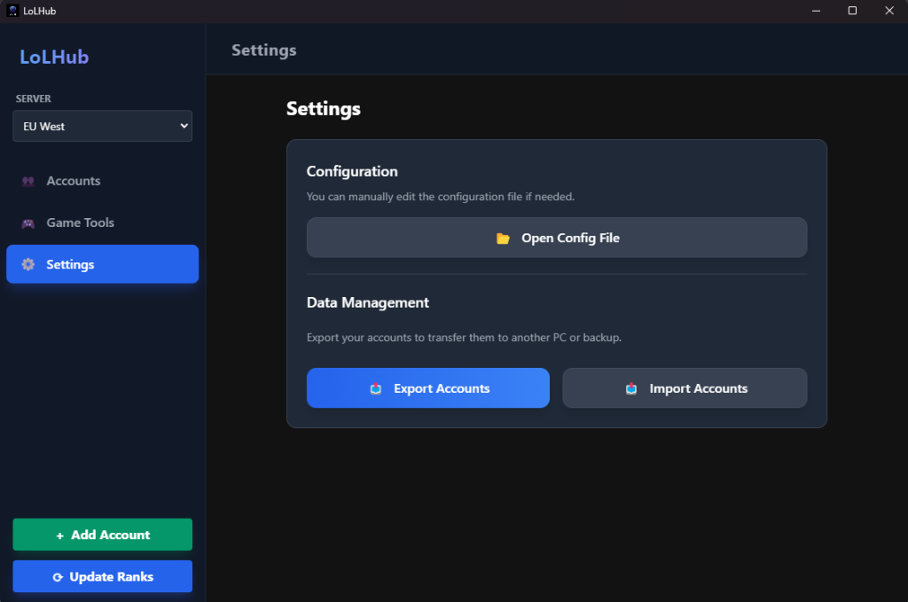

# LoLHub - Advanced League of Legends Account Manager 

**LoLHub** is a powerful, secure, and modern account manager for League of Legends. It helps you organize unlimited accounts, track ranked stats, and safely auto-login without compromising security.

##  Screenshots

### Dashboard & Accounts
Organize all your accounts in one place. See Rank, LP, and even decay warnings at a glance.

### Game Tools
Automate the boring stuff! Auto-accept matches, auto-pick your champion, and auto-ban specific bans.

### Visual Inventory
View your owned champions and skins with beautiful artwork directly from the LCU.

### Settings
Customize your experience, back up your data, and more.

---

##  Key Features

###  Secure Auto-Login with Focus Protection
Stop worrying about typing your password into Discord or Google Chrome by mistake!
- **Smart Detection:** LoLHub checks if the "Riot Client" window is in focus before typing.
- **Auto-Abort:** If you alt-tab during the login process, it immediately stops typing to prevent credential leakage.
- **Safety First:** Your passwords are encrypted locally and never leave your computer.

###  Multi-Server & "Other" Category Support
- **Global Support:** Manage accounts across all Riot regions (EUW, TR, NA, KR, etc.).
- **New "Other" Category:** Store accounts for friends or other purposes without polluting your main list.

###  Ranked Stats & Decay Tracking
- **Real-time Updates:** Automatically syncs Rank, LP, and Winrate directly from the LCU.
- **Decay Warnings:** For Diamond+ players, see exactly how many days until decay directly on the card.

###  Modern & Fast
- **Electron-based:** Built on modern web technologies for a smooth, responsive UI.
- **Local Storage:** All data is stored locally on your machine.
- **Dark Mode:** Sleek, gamer-friendly design.

##  Installation
1.  Download the latest `LoLHub Setup.exe` from the [Releases](https://github.com/OrhuunA/LoLHubReleases/releases) page.
2.  Run the installer.
3.  Enjoy!

##  Security Note
LoLHub is designed with security as a priority. Account credentials are encrypted using standard encryption methods and are only decrypted locally in memory for the auto-login process.

---
*Developed by OrhuunA*
